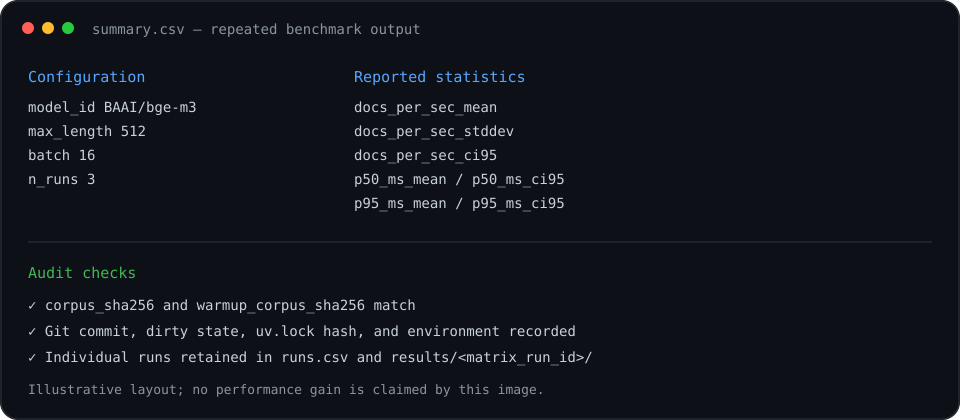

# PoC de Benchmark para Computacao Confidencial

[English](README.md) | [Português](README.pt-BR.md)

Benchmark reproduzivel e CPU-only para comparar workloads de embeddings entre
maquinas locais, GCP baseline e GCP com computacao confidencial. O benchmark usa
`BAAI/bge-m3`, datasets versionados, hashes de conteudo, dados de warm-up
isolados, metadados de ambiente por execucao e medicoes repetidas com intervalos
de confianca de 95%.



## Requisitos

- [uv](https://docs.astral.sh/uv/)

A versao do Python esta fixada em `.python-version`; o uv faz o download e cria
o ambiente virtual.

## Preparacao do ambiente

```bash
uv python install
uv sync
```

Para ambientes que restringem diretorios de cache do usuario:

```bash
UV_CACHE_DIR=.uv-cache UV_PYTHON_INSTALL_DIR=.uv-python uv python install
UV_CACHE_DIR=.uv-cache UV_PYTHON_INSTALL_DIR=.uv-python uv sync
```

Para downloads autenticados no Hugging Face:

```bash
cp .env.example .env
```

Configure `HUGGINGFACE_HUB_TOKEN` no `.env`. Esse arquivo e ignorado pelo Git.

## Datasets versionados

O repositorio contem dois datasets deterministicos:

- `data/corpus.jsonl`: 144 documentos medidos, com 24 documentos para cada
  tamanho aproximado: 256, 512, 1024, 2048, 4096 e 8192 caracteres.
- `data/warmup.jsonl`: 32 documentos deterministicos e estratificados por
  tamanho, usados apenas para estabilizar o mesmo pipeline de tokenizacao e
  encoding antes da medicao.

Valide ambos antes da execucao:

```bash
./scripts/verify_corpus.sh
```

O `run_all.sh` preserva e valida os datasets versionados existentes. Ele nao os
regenera por padrao. Para substituir intencionalmente os datasets e hashes:

```bash
./scripts/run_all.sh --regenerate-corpus
```

## Execucao individual

```bash
uv run python src/bench_embed.py \
  --corpus data/corpus.jsonl \
  --warmup-corpus data/warmup.jsonl \
  --batch 16 \
  --max-length 512 \
  --threads 8 \
  --warmup-docs 32
```

O throughput medido e calculado como:

```text
docs_per_sec = n_docs_measured / total_seconds_measured
```

Os documentos de warm-up nao participam da latencia, throughput, tempo de CPU
ou embeddings medidos. Os valores p50/p95 representam latencia amortizada por
documento, derivada da duracao de cada batch.

## Matriz com repeticoes

```bash
./scripts/run_matrix.sh
```

Por padrao, a matriz executa tres repeticoes para cada combinacao de
`max_length × batch`. Para alterar:

```bash
REPETITIONS=5 MAX_LENGTHS="256 512 1024" BATCHES="4 8" ./scripts/run_matrix.sh
```

Saidas:

- `runs.csv`: uma linha para cada execucao individual.
- `summary.csv`: medias, desvio padrao e intervalos de confianca de 95%,
  agrupados por modelo, tamanho maximo, batch, threads e hashes dos datasets.

Use os intervalos de confianca para comparar maquinas. Diferencas pequenas com
intervalos sobrepostos nao devem ser apresentadas como ganhos conclusivos.

## Runner completo

```bash
./scripts/run_all.sh --help
./scripts/run_all.sh
```

O runner completo instala a versao fixada do Python, sincroniza o ambiente uv,
valida os datasets, coleta metadados independentes do ambiente e executa a matriz
com repeticoes.

Opcoes uteis:

```text
--repetitions N
--regenerate-corpus
--skip-python
--skip-sync
--skip-dataset
--skip-env
--skip-matrix
```

## Artefatos da execucao

Cada execucao grava:

- `results/<run_id>/embeddings.npy`
- `results/<run_id>/embeddings.sha256`
- `results/<run_id>/run.jsonl`
- `results/<run_id>/env.json`

Execucoes da matriz gravam runs aninhados em `results/<matrix_run_id>/`, alem de
`runs.csv` e `summary.csv`.

Os metadados de ambiente sao coletados em modo best-effort e incluem topologia
de CPU, microcode, politica de frequencia, NUMA, afinidade, memoria,
armazenamento e mounts, kernel e parametros de boot, alem de evidencias de
computacao confidencial. Sinais ausentes ou restritos por permissao sao
representados explicitamente no JSON.

## Reproduzindo uma comparacao

Em cada maquina:

1. Obtenha o mesmo commit Git.
2. Execute `./scripts/verify_corpus.sh`.
3. Confirme hashes identicos para o corpus e o warm-up.
4. Use a mesma matriz, quantidade de threads e repeticoes.
5. Compare `summary.csv` e preserve cada diretorio de run como artefato de
   auditoria.

Nao versione `.env`, `results/` ou `reports/`.
